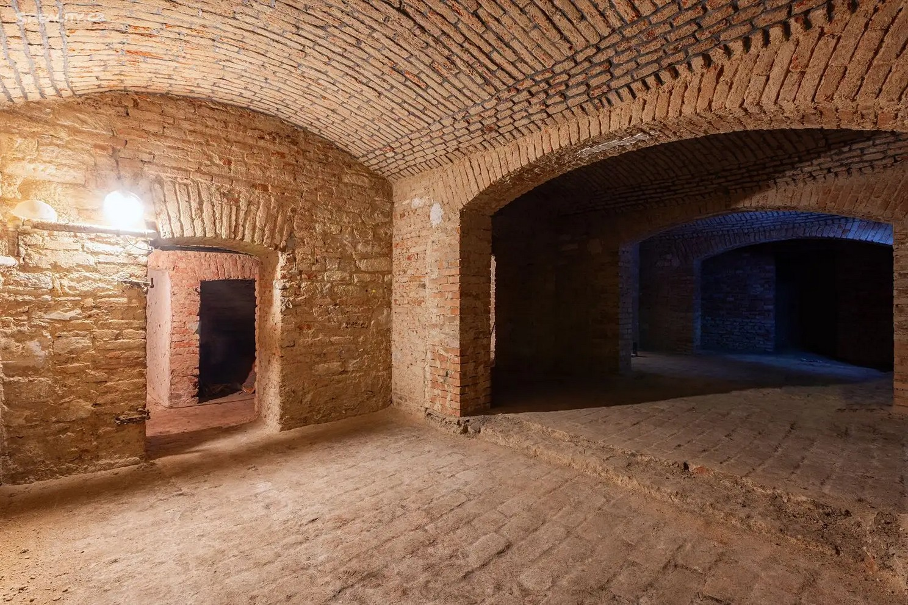

Things to sync-on on the call on Saturday:
1) Should we call it a hackerspace? Or makerspace? Or community hub? I was thinking that "hackerspace" sounds maybe too technical oriented, which if we also want to attract (do we?) non-tech people more into the art, etc., the name "hackerspace" can discourage then?.

2) How much to describe the physical location? Should we make some photos that we could use for the web when we will checkout the space one more time on Monday?

3) Where to put the video that Martin will make?

4) Go through the rooms in the space, what we can put there, what ranges of actions we can do there, etc. Make something specific and some plan of what should be in each room.

5) What exactly we will be providing/doing in the "art" part.

# Bordel Hackerspace
## Transforming Chaos into Shared Creations

## What We Are, Why We Exist, and Our Vision
Bordel is a community hackerspace for hackers, makers, artists, and anyone who embraces (peaceful/productive) chaos, creativity or technology. 

Originally opened in Paralelni Polis, after three years of building community, organizing workshops, hackathons, art projects and raves, we are moving to a new independent space in Prague.

Our vision is to create a space that connects technology and art, space where individuals can come together to create, hack, learn, innovate, meet like-minded individuals and build a community.

Our goal is to create bridges between aligned communities which can meet and collaborate in new ways. We believe there are many people who could work together to create new and amazing things, only if we overcome prejudice and tear down walls. Everyone, on any kind of spectrum, is welcomed in the space and should feel right at home.

Of course we are not limited by physical meetups in the space. With the right equipment, our talks and workshops will be recorded to provide the education to wider public in online space.

We aim to create an environment where individuals can come together to hack, create, learn, and innovate. Our values are rooted in open source principles, fostering culture of sharing and cooperation.

## Support Our Mission
As we transition to our new location, we're seeking financial support for the start. Bordel is non-profit collective. By participating in our loan initiative, you can help us build this space while still receiving some annual percentage rate (APR) on your money. Although the APR might be lower than other investment options, your contribution will directly support the growth of a community-focused hub for creativity and technology.

If you believe in the importance of collaboration and open-source principles, we invite you to lend your support.

(https://bordel.pwn.xyz)[Lend now]

3 different ways to support us:
- Investments. We are looking for investors who are interested in co-owning the space and sharing
the responsibility. Co-owners can have their own dedicated part of the space and their investment
keeps the value of Prague real estate
- Lending. We are creating a community funded onchain loan with small APY for people willing to
lock their stablecoins to support the space.
- Donations. A direct donation to the community, e.g. by sending money to bordel.eth or any other
form of monetary or in kind donation. Donors will be acknowledge at our website and largest
donations will earn their plaque at the physical space.

## A Space for Everyone
Bordel Hackerspace is designed to be versatile and welcoming, catering to a variety of activities, including:

- Co-working Spaces: Comfortable areas with stable tables for everyone looking to get things done.
- Makerspace: Fully equipped with tools for various projects — 3D printers, soldering stations, and more.
- Art studio: to create and display paintings, sculptures and all kinds of contraptions
- Bio-hacking lab, food lab and community bar - offering mate, kombucha, mixer for doing smoothies
- Audio Setup: Featuring speakers, a DJ controller, synths, and equipment for casual jams and events.
- Workshops and Meetups: An open area for community gatherings and workshops, whether public or private.

We operate on a do-ocracy principle, meaning that everyone’s input is valued. We want to hear your ideas on how you’d like to utilize this space.

The space acts as a members club with members having full access and freedom to organize public
events. The membership is open to host anyone interested in technology, art and freedom. With the
classic hackerspace approach of do-acracy, anyone willing to participate in the space and organize
events is welcomed to do so.

### Physical space description

The interior design is based on idea of modularity. Tables and installations are movable, foldable
and mobile enough to be arranged in various ways. This allows to fully utilize the space, change the
setup for current needs – workshops, coworking, presentation, dance party, etc.
Various installations and modularity also allows us to change the space beyond a simple evolution.
Instead of the same old place, people visiting will always find something different at the end of
stairs.

The search for the new residency of Bordel hackerspace proved to be a tough task. Community ran
nonprofit has to face reality of Prague real estate market. Despite that, we kept searching for a new
basement which would allow us to create an independent space and scale it up.
The basement is not only a tradition from original Bordel but provides various benefits for this kind
of space. In the context of real estate market, basements tend to be significantly cheaper than
regular office spaces. At the same time, a dark basement allows us to control the lightning any way
we want, install custom light shows and an artificial sun. Depth of the basement is a great sound
isolation so we don’t bother neighbors with loud tools or music. Linux hackers will appreciate the
lack of Windows which also allows us to better isolate the space and save on heating.

With all of this in mind and after visiting many potential spaces in Prague and Barcelona, we found
a suitable one for sale. Located in Palmovka, relatively close to Prague center and only few minutes
from old Bordel. This basement has 162m2 with more than enough room to scale up our vision of
new generation community hackerspace. The interior has brick walls, arch ceilings and is divided
into 2 big ares with 5 smaller rooms. It includes also a part of outdoor area in courtyard which can
be turned into a patio.
It’s listed for sale for 5.5m czk (~220k euros) and needs basic renovation for another roughly 50k
eur. After the experience of renovating and opening a hackerspace in a rented space, we believe that
buying is more sustainable, will be a good investment and enable us much more freedom in using
the space. The space is a blank slate and enables us to create a custom experience to realize our
vision of modern hackerspace/coworking/community workshop.

(TODO add another images of spaces we want to buy here)

## A Glimpse at Our Activities
We will have regular core events for education, community coordination, artist collaboration (vernisage), but apart from that all members are welcome to organize events for their community and friends and bring new kind of people to Bordel.

Come for art, discover technologies.

The original was a small space with relatively small but very community and many visitors. Our members contributed to bunch of cool projects and organized a ton of events for art and education. We...

- built [Catropy](https://proofof.cat), a cat toy device for extracting secure entropy from felines used to secure cryptography in KZG ceremony
- created the very first Bitcoin Lightning NFC payments and pioneered the technology
- created an art installation from upcycled hardware and cartridges 
- built Bleskomat, first offline Bitcoin Lightning ATM using LNURL and helped to onboard hundreds of people
- hosted FOSS software for the community, providing a privacy respecting alternative to proprietary services 
- hosted nodes and tools for various blockchains, including mixers 
- organized music events Synapse, hosting local artists and DJs 
- hosted a coordination for testing Ethereum switch to proof of stake
- organized workshops on 3D printing and creative prototyping 
- workshops on biology and sustainability, growing mycelium in the space
- workshops on neopixel, art with programmable LED lights
- Security/privacy workshops, installing GrapheneOS, GNU/Linux 
- workshop on hacking Playstation and liberating hardware
- organized non-conformist hackatons Hackatoshi's Flying Circuity[flyingcircuit.com]
- workshops on hacking self defense tools 
and even more!

To kick start the community in the first couple of months, we are planning to organize events on
programming, hardware hacking, gnu/linux, self hosting, music creation, 3D printing, opsec,
woodworking, chemistry and more. In long term, Bordel can provide sustainable shelter for various
communities and educational programs

We’re always open to new ideas and activities from realm of art, technology and whatever else comes to your mind!

## Future plans
The space provides an open platform for all people interested in creating, learning, researching and building. Apart from community projects and hobbies, the long term goal is to create a launchpad program where we streamline the process of education for builders who are then connected to mentors and investors helping to realize their visions. This can include for profit projects, FOSS public goods infrastructure of software and hardware as well as art and science projects.

## Legal BS

Ownership and exit:
The space will be owned by a joint-stock company (Czech a.s.) which holds share of each co-
owner. If some investor requires to own it anonymously, we can create additional proxy companies.
Co-owners who invested in the space agree on predefined exist strategy, owners allocation and buy
out process is clear from the beginning to avoid any further issues.
When someone wants to exit with their liquidity, we will follow Texas Shootout Clause. This
applies also if the process if the whole place decides to shut down or if there is a member/co-ownerwho significantly breaks the rules and needs to leave. Rules are defined by members but for
example by calling the cops, you are giving up your membership/co-owner rights.

## Get Involved!
If you're interested in what we do and want to contribute your skills, ideas, or resources, please reach out using the form below. We welcome everyone to join us in shaping the future of Bordel Hackerspace.

Let’s create something amazing together!